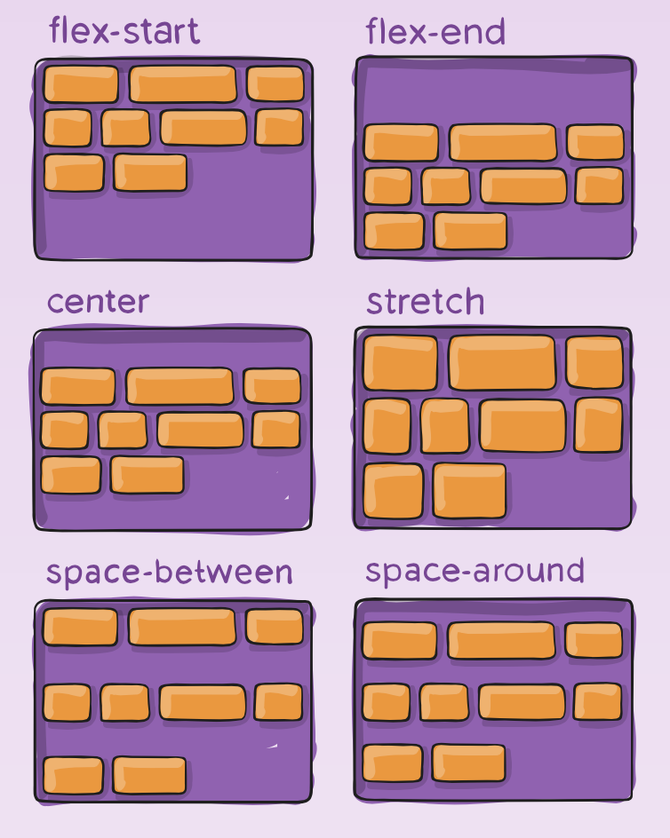

# Flexbox

## Resources
Here are some essential resources to help you master Flexbox:

- [A Complete Guide to Flexbox | CSS-Tricks](https://css-tricks.com/snippets/css/a-guide-to-flexbox/)
- [Flexbox Froggy - A game for learning CSS flexbox](https://flexboxfroggy.com/)
- [Flexbox Defense](http://www.flexboxdefense.com/)
- [Flexbox Cheatsheet](https://flexbox.malven.co/)
- [CSS Flexible Box Layout - CSS: Cascading Style Sheets | MDN](https://developer.mozilla.org/en-US/docs/Web/CSS/CSS_Flexible_Box_Layout/Basic_Concepts_of_Flexbox)
- [afonsopacifer/awesome-flexbox: A curated list of CSS Flexible Box Layout Module or only Flexbox](https://github.com/afonsopacifer/awesome-flexbox)
- [Build with Flexbox](https://buildwithflexbox.com/)
- [Flexplorer](https://www.flexbox.ninja/)
- [CSS Flexible Box Layout Module Level 1](https://www.w3.org/TR/css-flexbox-1/)
- [FLEX: A simple visual cheatsheet for flexbox](https://flexbox.help/)

## Learning Objectives
By the end of this project, you should be able to explain the following concepts without referring to external sources:

1. **What is Flexbox?**
   - Understanding the CSS Flexible Box Layout model.
   
2. **How to convert float positioning to a flex display**
   - Techniques for replacing legacy float layouts with modern Flexbox layouts.

3. **How to horizontally and vertically align elements using Flexbox**
   - Mastering alignment properties for both axes.

4. **The difference between the main and cross axes**
   - Understanding the orientation of content within a flex container.

5. **Properties that work on flex elements vs flex container**
   - Distinguishing between container-level and item-level Flexbox properties.

6. **Shorthands for flex**
   - Using shorthand properties for concise code.

7. **How to create a new page with flex in mind**
   - Best practices for designing layouts using Flexbox from the ground up.

## Requirements

- **Coding Standards**:
  - All your files should end with a new line.
  - A `README.md` file at the root of the project folder is mandatory.

- **Restrictions**:
  - You are not allowed to install, import, or use external libraries. This website must be built using only **HTML** and **CSS**.
  - Frameworks such as NodeJS, React, VueJS, Bootstrap, etc., are not allowed.

## Files

### Required Images
Download the required images for your HTML files and place them into an `images` directory at the root of the project. Use the images linked in the CSS Advanced section. 

